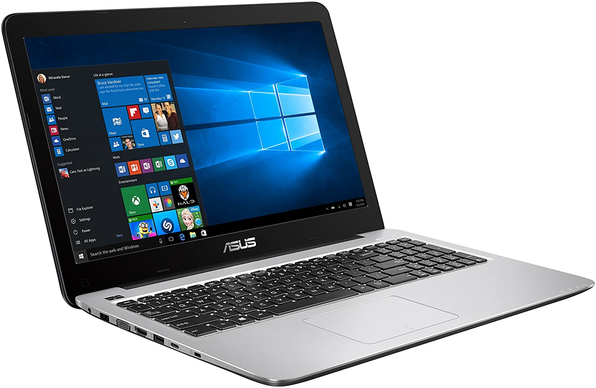
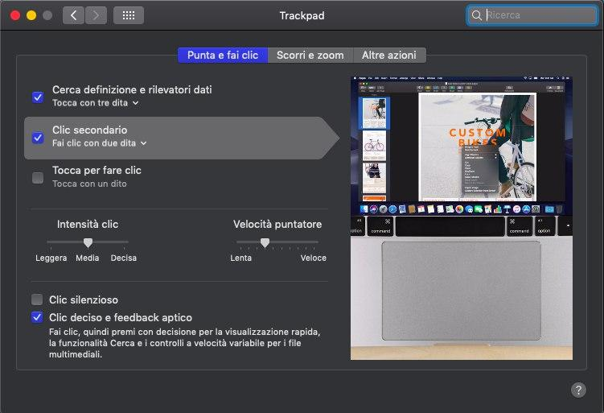
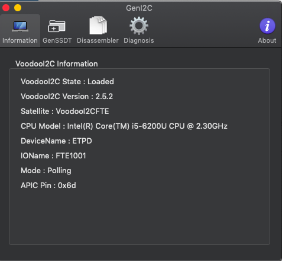

# ASUS-X556UJ

### Computer Spec:

| Component        | Brank                              |
| ---------------- | ---------------------------------- |
| CPU              | Intel I5 6200U                     |
| iGPU             | Intel® HD Graphics 520             |
| Lan              | Realtek 8111                       |
| Audio            | Realtek ALC255                     |
| Ram              | 8 Gb DDR4 2400 Mhz                 |
| Wifi + Bluetooth | BCM943602BAED                      |
| NVMe             | TOSHIBA KBG4 256 Gb                |
| SSD              | Crucial BX500 240 Gb               |
| SmBios           | MacMini 8,1                        |
| BootLoader       | Clover                             |

### Touchpad I2C:

## Credits

- [Apple](https://apple.com) for macOS;
- [Acidanthera](https://github.com/acidanthera) for OpenCore and all the lovely hackintosh work.
- [Dortania](https://github.com/dortania)
- [mald0n](https://github.com/MaLd0n)
- [rehabman](https://github.com/RehabMan)
- [daliansky](https://github.com/daliansky)
- [Hackintoshlifeit](https://github.com/Hackintoshlifeit)

# If you need help please contact us on [Telegram](https://t.me/HackintoshLife_it) or [Web](https://www.hackintoshlife.it/)
